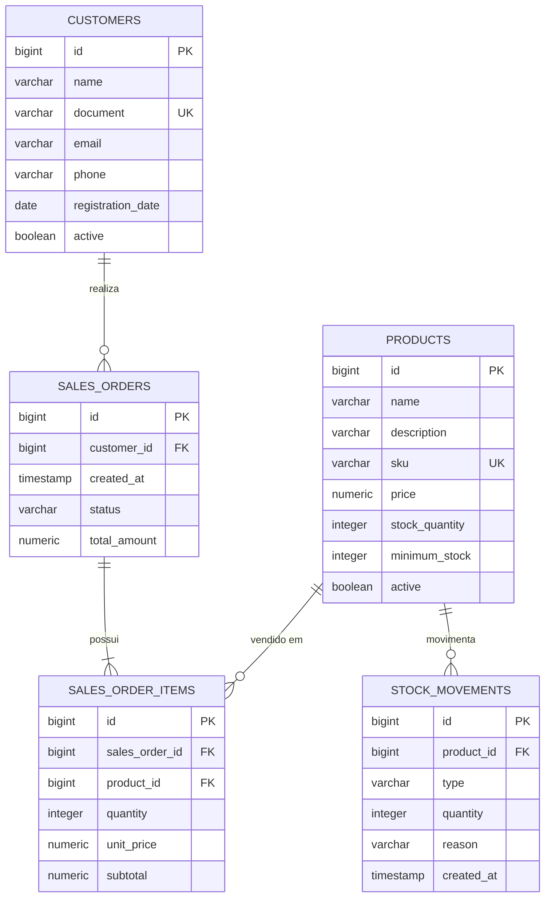

# Diagrama de Entidades

## Relacionamentos

- Um cliente pode realizar varios pedidos.
- Um pedido pertence a um cliente.
- Um pedido possui um ou mais itens.
- Cada item referencia um produto.
- Um produto pode aparecer em varios itens de pedido.
- Um produto possui varias movimentacoes de estoque.
